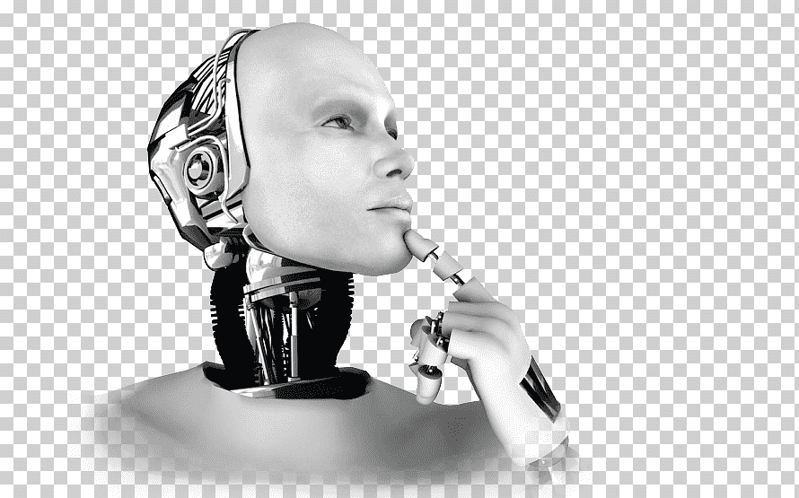

# Programacion e inteligencia artificial 
### Autor: Deivy Ayala
## **Programación** 
El objetivo final de la programación es la de crear software, 
el cual después será ejecutado de manera directa por el hardware de la computadora, 
o a través de otro programa, para desempeñar diversas labores para las cuales fue diseñado.

#### *Temas de programación*
- Lógica
- Calculo 2
- Fundamentos de programar
- Principio del desarrollo de software

## **Inteligencia Artificial** 
es una disciplina y un conjunto de capacidades cognoscitivas e intelectuales expresadas por 
sistemas informáticos o combinaciones
de algoritmos cuyo propósito es la creación de máquinas que imiten la 
inteligencia humana para realizar tareas, y 
que pueden mejorar conforme recopilen información.

#### *Temas de Inteligencia artrificial*
- Artificial Narrow Intelligence
- Inteligencia Artificial Genera
- Memoria Limitada
- Autoconciencia

## Tablas
| Temas        | Inteligencia | Programación |
|--------------|--------------|--------------|
| Temas        | Texto 2      | Texto 3      |
| Actividades  | Texto 5      | Texto 6      |

##Imagenes 

## Referencias 
[Video Inteligencia artificial]([https://www.google.com](https://www.youtube.com/watch?v=PPMb_rrej5c)

